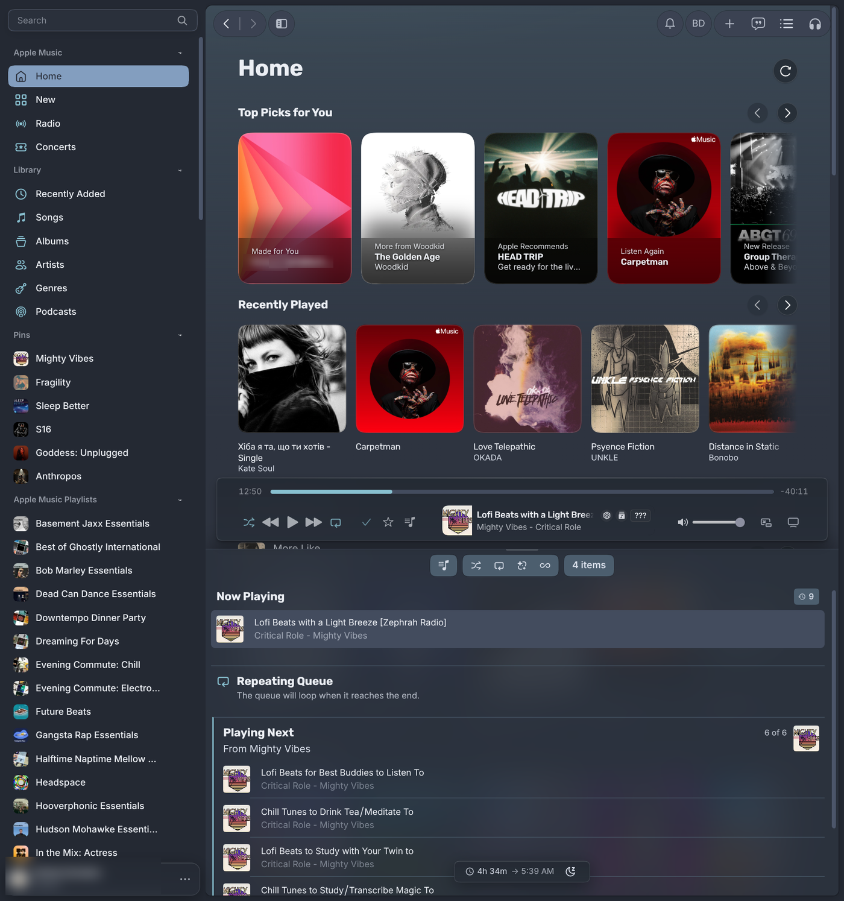
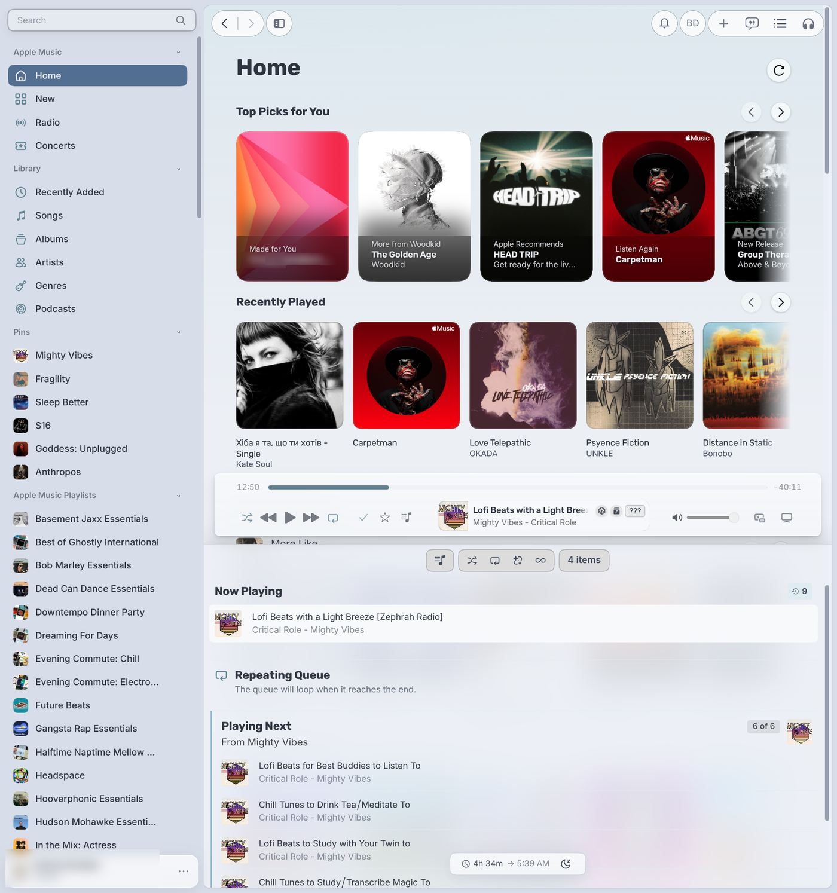
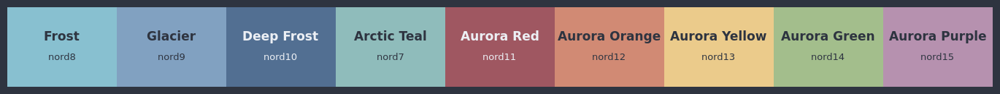
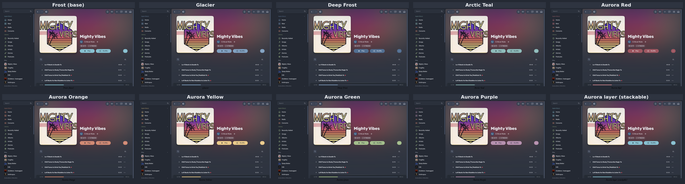
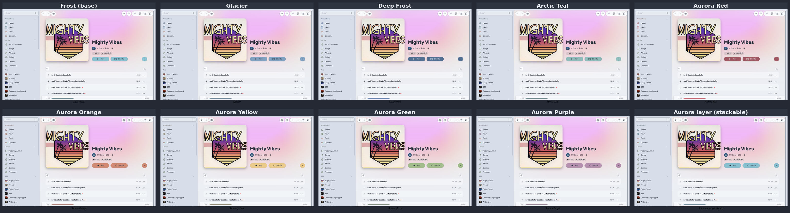
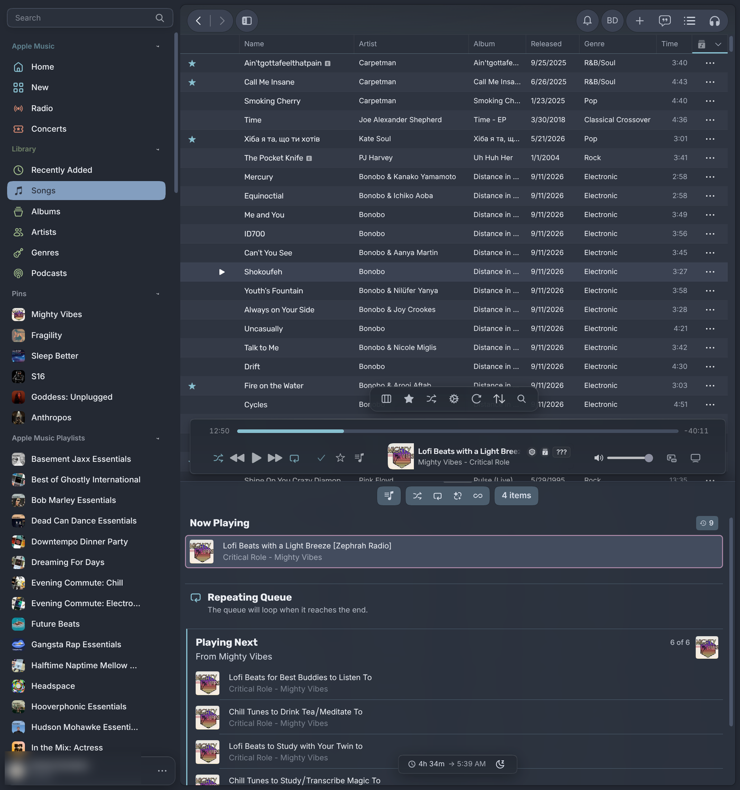
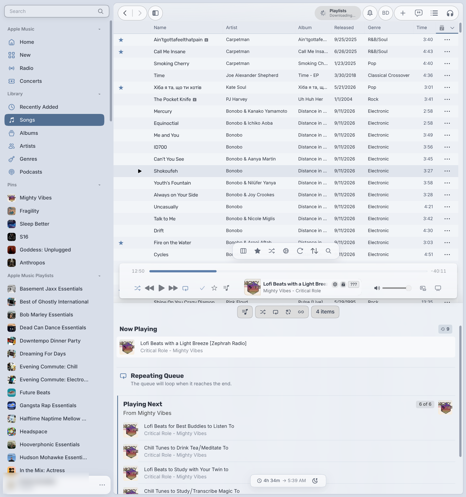
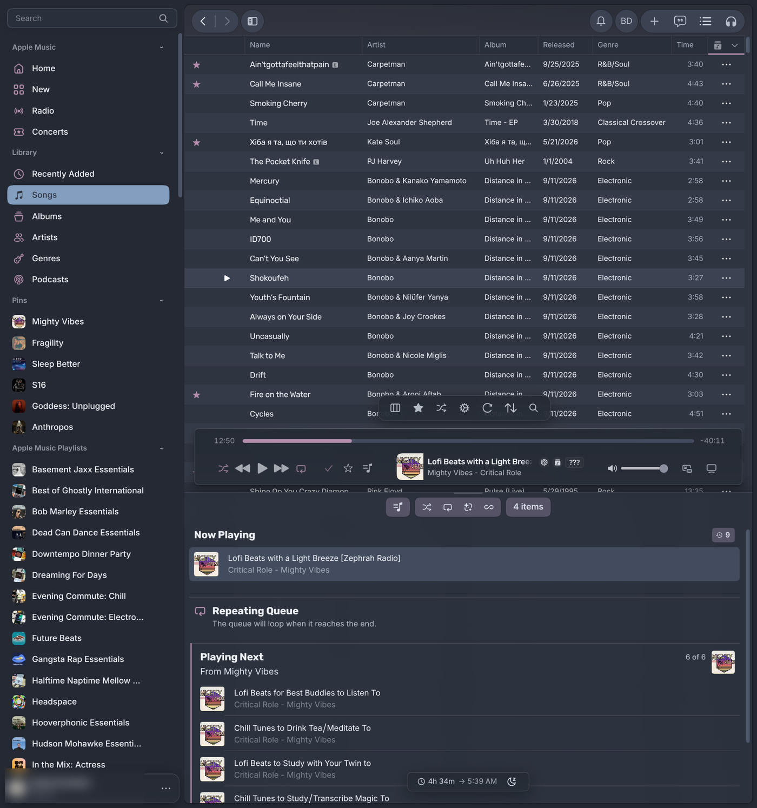

# Nord for Cider

The [Nord](https://www.nordtheme.com) palette for [Cider 4](https://cider.sh), the Apple Music client.
It feels native to Cider's Apple Music design, painted in Nord: Cider's own structure, density,
rounded geometry and floating glass player stay exactly as they are, while every surface, text
tone and accent comes from Nord. Polar Night or Snow Storm, one Frost accent, and Aurora colours
only where they mean something. Light and dark share one set of rules; only the colours differ.

| Dark (Polar Night) | Light (Snow Storm) |
|:---:|:---:|
|  |  |

## How it is put together

Like Catppuccin and CiderPunk, Nord ships as stacked stylesheets. Enable them under
**Settings → Extensions → Themes → Nord**:

| Stylesheet | What it does |
|---|---|
| **Nord (base)** | Required. Follows Cider's own Light/Dark appearance setting: Polar Night when Cider is dark, Snow Storm when it is light. Frost (`nord8`) accent. |
| **Aurora layer** | Optional, stacks with any accent. Colour by meaning: the sung lyric sweeps yellow, what's playing now wears purple, favourites (stars) yellow, remove red, sidebar sections get their own tone (Frost for Apple Music, orange for live Radio/Concerts, green for your Library). |
| **Accent: …** | Optional, enable **one** on top of the base. Glacier, Deep Frost, Arctic Teal, Aurora Red, Orange, Yellow, Green, Purple. |



### Every variant

All eight accents plus the Aurora layer, on the same playlist, in both modes
(header tint comes from the album artwork, which Cider adapts per playlist).

**Dark (Polar Night)**



**Light (Snow Storm)**



### Close-ups

| Aurora layer (dark) | Deep Frost accent (light) | Aurora Purple accent (dark) |
|:---:|:---:|:---:|
|  |  |  |

## Motion

Row, sidebar and queue hovers fade their fill in (180 ms); icon buttons fade colour and a soft
pill (120 ms) while keeping Cider's own hover and press transforms; marketplace cards and settings
tiles lift 1px (260 ms). Easing is `cubic-bezier(.2,.8,.2,1)`. Animated properties: colour,
background, border, opacity, transform, box-shadow and a light brightness filter on artwork.
Reduced motion is honoured from both the system setting and Cider's own reduced-motion toggle;
elements Cider marks as essential (loading spinners) keep animating.

## Typography

Nord's own pairing, as used on nordtheme.com: **Rubik** for titles and lyrics, **Inter** for the
interface. Both fonts ship inside the theme (variable woff2, Latin, Latin Extended and Cyrillic,
SIL Open Font License, see `fonts/`), so there is no external font request and the theme works
offline.

## Accessibility

Every colour a rule paints with is a named role, and each role lists the surfaces it may sit on.
`build.py` checks every role on every surface, in both appearances and with every accent, and fails
below WCAG AA: 4.5:1 for text (including links and muted text on hovered rows, and text on accent
fills), 3:1 for icons, focus rings, selected-row markers, progress, switches, input and checkbox
borders and the scrollbar thumb. Translucent surfaces are checked composited over their worst-case
backdrop. Captions on artwork cards sit on a scrim sized so they reach 4.5:1 even over a pure white
cover, and the immersive player uses fixed dark glass instead of artwork-derived colours. Cider's
High Contrast mode switches the theme to maximum-contrast Nord tokens. Keyboard focus is always
visible in the accent colour.

## Transparency

Window translucency is a compositor/OS feature, not part of the theme. Nord paints every layer
opaque on purpose. If you run a CSS snippet that makes Cider's background transparent (for
example "Transparency Theme for Linux"), it overrides some of those layers in dark mode, and pages
can show the desktop or black behind them. Disable the snippet if dark pages look broken.

## Install

**Marketplace:** Settings → Extensions → Themes → Marketplace → search "Nord".

**Manual:** copy the theme files (`theme.yml`, `main.css`, `aurora.css`, `accent-*.css`) into a
folder in Cider's themes directory, then enable the stylesheets you want. On Linux that is
`~/.config/sh.cider.genten/themes/`; on Windows and macOS it is the `themes` folder inside
Cider's `sh.cider.genten` app-data directory.

After changing files, toggle the theme off and on (or restart Cider); Cider keeps the compiled
theme until then.

## Building

All CSS is generated from one token table:

```sh
python3 build.py --report
```

Edit the token table in `build.py`, not the CSS. `preview/` holds the same CSS with `!important`
applied (what ThemeKit does at load), for live previews.

## Changelog

See [CHANGELOG.md](CHANGELOG.md).

## Credits

- [Nord](https://www.nordtheme.com) by Arctic Ice Studio.
- Third-party notices: `THIRD-PARTY-NOTICES.md`.
- Selector map in the lineage of [Catppuccin for Cider](https://github.com/catppuccin/cider) (MIT);
  stacked-accent structure as in Catppuccin and [CiderPunk Dark](https://github.com/aiaiaioh/CiderPunk-Dark).
- Cider 4 variable layout first seen in *Omarchy Your Cider* by mattco (marketplace #92).
- Background and progress-bar handling researched against CiderPunk Dark and Ciderify v2.

## Screenshots

The screenshots and banner show the author's own library (artist photos, album covers, Apple Music
badges) for illustration only. They are not part of the theme.

## License

MIT
