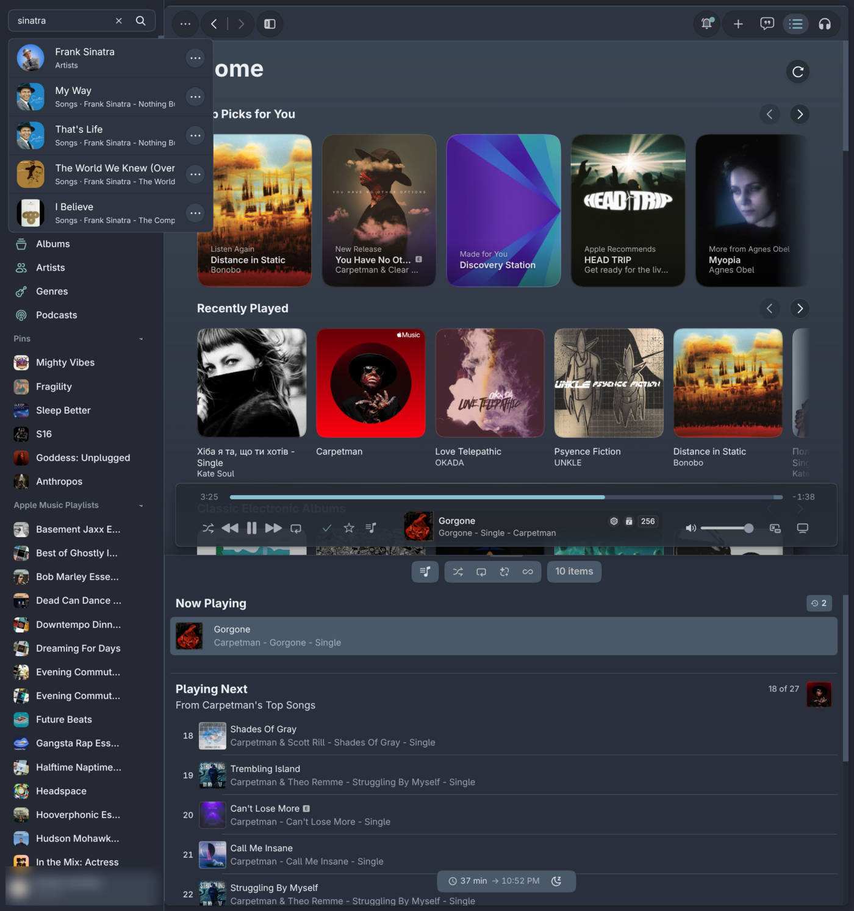
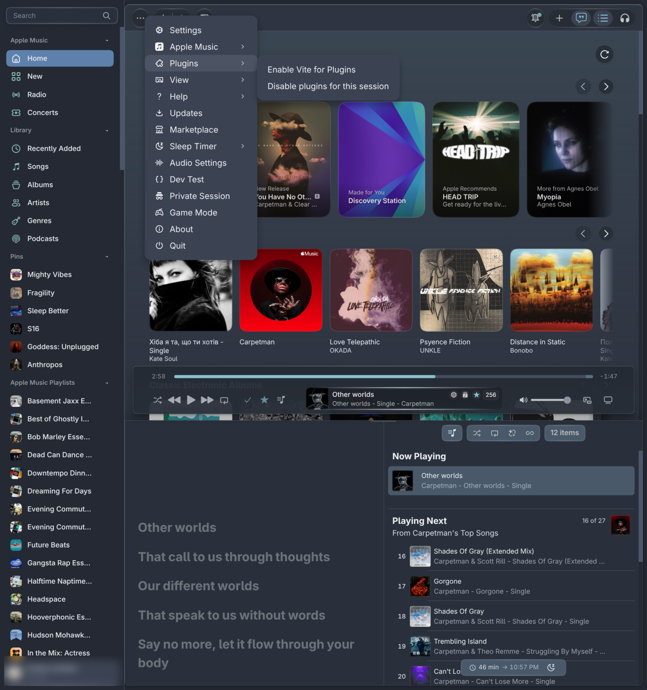
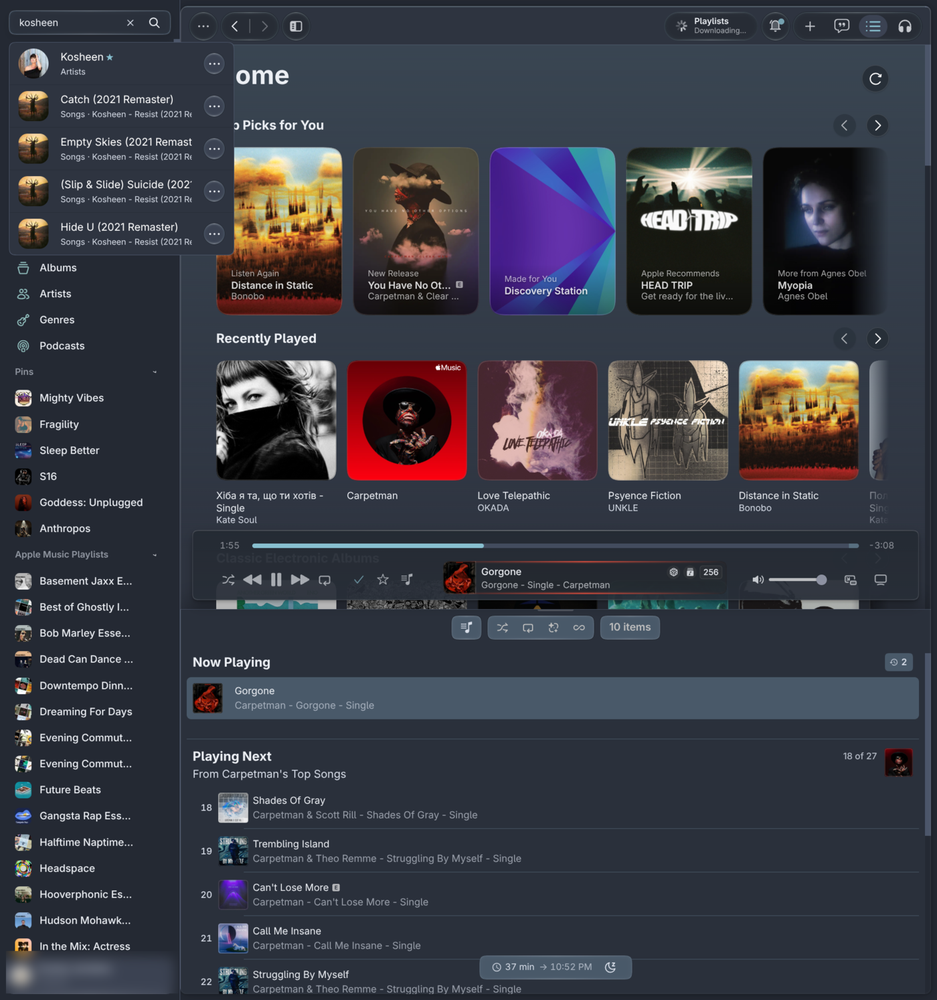

# Nord for Cider

The [Nord](https://www.nordtheme.com) palette for [Cider 4](https://cider.sh), the Apple Music client.
Polar Night surfaces, Snow Storm text, Frost accents and Aurora for status colours,
with Cider's own rounded corners kept.

| Menu | Search |
|:---:|:---:|
|  |  |

## What it covers

- Every page background, including Home and library pages. With window transparency
  (mica/acrylic) on, Cider leaves some layers transparent; this theme paints each one,
  so nothing renders black on platforms without blur.
- Sidebar, selected item (Frost blue), account chip, track lists with a soft zebra stripe.
- Player: Frost progress and volume, readable dark text on accent buttons.
- Lyrics (yellow karaoke sweep, Frost for sung lines), queue, dialogs, settings, menus, search.
- Dialog tint: Cider mixes its accent into near-black for dialogs; this theme replaces that
  with Polar Night.

## Install

**Marketplace:** Settings → Extensions → Themes → Marketplace → search "Nord".

**Manual:** copy this folder into Cider's themes directory, then enable *Nord* under
Settings → Extensions → Themes.

On Linux that is `~/.config/sh.cider.genten/themes/`. On Windows and macOS it is the
`themes` folder inside Cider's `sh.cider.genten` app-data directory.

After editing the CSS, toggle the theme off and on (or restart Cider); Cider keeps the
compiled theme until then.

## Credits

- [Nord](https://www.nordtheme.com) by Arctic Ice Studio.
- Selector map in the lineage of [Catppuccin for Cider](https://github.com/catppuccin/cider) (MIT).
- Cider 4 variable layout first seen in *Omarchy Your Cider* by mattco (marketplace #92).
- Background and progress-bar handling researched against
  [CiderPunk Dark](https://github.com/aiaiaioh/CiderPunk-Dark) and Ciderify v2.

## License

MIT
